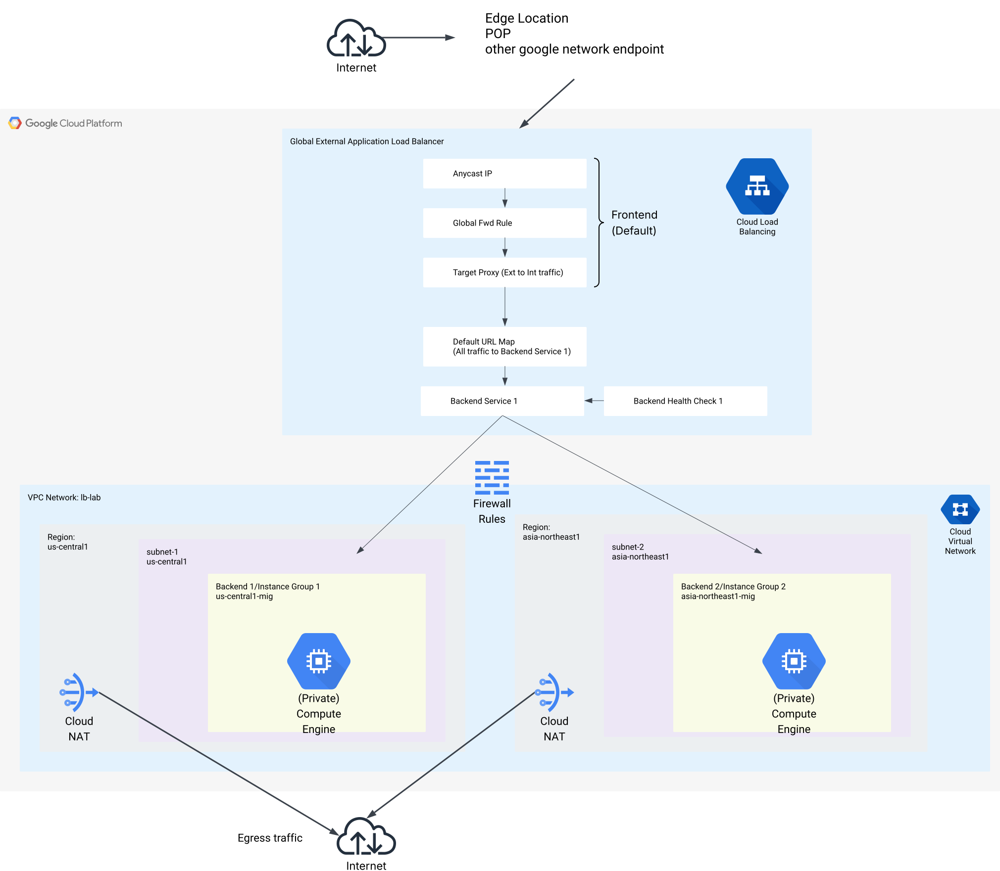

# Notes for Deploying a Global LB with High Availability (HA), Elastic private instnaces 

## Key Points
- Deployed in two regions (global)
- Private instances with no public IPs or direct internet access
- Use Cloud NAT to enable egress access for private instances
- Auto-scaling and auto-healing instances via a MIG in each region
- Internet-facing, global HTTP Load Balancer
- Anycast IP at edge and POP locations in GCP

## Documentation

1) Global Load Balancer basics
     - [Global External Application LB](https://cloud.google.com/load-balancing/docs/https/setup-global-ext-https-compute)
     - [Cloud Skills Boost Lab](https://www.cloudskillsboost.google/focuses/1232?catalog_rank=%7B%22rank%22%3A2%2C%22num_filters%22%3A0%2C%22has_search%22%3Atrue%7D&parent=catalog&search_id=44407083)
     - [Deep Dive into Global LB](https://cloud.google.com/blog/topics/developers-practitioners/google-cloud-global-external-https-load-balancer-deep-dive)

2) Cloud NAT
    - [Cloud NAT](https://cloud.google.com/blog/products/networking/simplifying-cloud-networking-for-enterprises-announcing-cloud-nat-and-more?fbclid=IwY2xjawJo3NNleHRuA2FlbQIxMAABHnMSx9a1KDFUeXEUtUjVywUhY6ded-9zkGIy6910pMk8OHURzjzKfVj0LvDg_aem_hzd4Ze83-6ttbDtaWnxd-A)
    - [Cloud NAT](https://l.facebook.com/l.php?u=https%3A%2F%2Fcloud.google.com%2Fnat%2Fdocs%2Foverview%3Ffbclid%3DIwZXh0bgNhZW0CMTAAAR4Znhvebmvt1Loipbv8vAaPrtoqBNPFzEDUeBowPDQ6xhNP4jCEYG-38WAHGA_aem_ZjYiHNs5GkLfvHtz-ZQNgg&h=AT271Xn6VSadpqyxYORKXCWoTdp-UwZS0uBT_ARCa45hc3fAe4z3vMLfpmThzeyKBTgtuASY8cCq6_iy0NYsWVMFWAyVF-eRu2eWtVP7lL8hGbnkU1APOJFwzQ7UJtBZvF6aYViX-WnOWdlOjUnsyw)

## Architecture

## Resource Provisioning Order

1. VPC (with two subnets)

2. 
    - Firewall Rules or
    - Cloud NAT + Cloud Router (in each region)
    - Instance Template (one for each region)

3. Managed Instance Group (MIG) with health checks & autoscaling
4. Global External LB with one backend service

---
## Part 0 - Open Console

- Open tabs for Compute Engine, VPC, and Network Services; also a tab for the Start up script repo and one for the architecture diagram. 
- This means 5 tabs are all that is needed

## Part 1: Provision Networking Infrastructure

### Step 1 - Create a VPC

Questions to consider:
- Do we need a custom VPC or will the default work?
- How many subnets are necessary?
- Can we use default firewall rules?

Instructions:
1. Navigate to **VPC Networks**
2. Click **Create VPC**
3. Name it accordingly (e.g., `lb-lab-vpc`)
4. Create subnets
   - Create two subnets with a /24 CIDR 
   - One region should be in the US, one outside of  the US
   - Put region 1 here:
   - Put region 2 here: 
5. Disable default firewall rules
6. Leave other options as default and create the VPC

### Step 2 - Configure Cloud NAT and Cloud Router

Questions to consider:
- What is NAT and why is it needed?
- What is a Cloud Router?
- Why do we need a Cloud Router?
- Can we do this lab a different way without this?

Instructions:
1. Go to **Network Services > Cloud NAT**
2. Click **Create NAT Gateway**
3. Name it then set NAT type to **Public**
4. Under **Select Cloud Router** choose your VPC and region 1 (in the uS)
5. Under **Router**, click **Create New Router**
    - Name it (e.g., `sunday-router`), describe it
    - Leave BGP settings as default
6. Ensure source endpoint and IPv4 mapping are correct
7. Click **Create**
8. Repeat steps 2-7 for region 2

### Step 3 - Configure Firewall Rules

Questions to consider:
- What is TCP:80?
- Why are we allowing this traffic?
- Can we configure it differently? 

Instructions:
1. Go to **VPC > Firewall Rules**
2. Click **Create Firewall Rule**
3. Name the firewall rule something like: "<YOUR-VPC-NAME> - <ACTION> - <PROTOCOL/PURPOSE>"
4. Description: "Allow HTTP and HC traffic"
5. Direction: **Ingress**, Action: **Allow**
6. Targets: 
     - EXTRA IMPORTANT
     - Choose specified Target tags
     - Choose a tag and enter it here: 
7. Source: **All IP ranges (0.0.0.0/0)**
8. Protocols/Ports: TCP:80
9. Click **Create**

---

## Part 2: Provision Compute Infrastructure

### Step 1 - Create an Instance Template

Questions to consider:
- Which machine type and OS?
- Which startup script is needed?
- What networking settings are needed?

Instructions:
1. Go to **Compute Engine > Instance Templates**
2. Click **Create Instance Template**
3. Name it (e.g., `us-template`), select **Global** and select correct region
4. Go to advanced options at bottom of screen
5. In **Networking**:
    - IMPORTANT: add network tag you made earlier 
    - Edit the network interface
      - Choose your VPC and Subnet
      - Disable External IP
      - Click on done after reviewing this
6. In **Management > Automation**:
    - Paste startup script
7. Click **Create**
8. Repeat steps 2-7 for region 2. 

### Step 2 - Create Managed Instance Group (MIG)

Questions to consider:
- What is autoscaling and how does this help us do it?
- What is autohealing and how does this help us?
- How does this help us minmize costs? 
- How does it know when to scale? 

Instructions:
1. Go to **Compute Engine > Instance Groups**
2. Click **Create Instance Group**
3. Name it (e.g., `us-mig`), use the previously created template in the US
4. Choose **Multiple Zones** in the same region
5. Enable autoscaling:
    - Minimum: number of zones
    - Maximum: 2× zones (max 8)
6. Create a health check
     - Click on drop down menu for health check and click create health check
     - in right hand menu that opens
     - name it
     - change check interval to 10 s, and unhealth threshold to 3 
     - save
     - ensure health check is selected in instance group 
7. Click **Create**
8. Do step 2-5 for region 2, use the health check you made in step 6 for region 1 (you can reuse it)

---

## Part 3: Provision Load Balancer

Questions to consider:
- What does a LB do?
- What roles do the frontend and backend play?
- Why an application LB?
- Why an external or public facing LB?
- Why a global LB? 

Instructions:
1. Go to **Network Services > Load Balancing**
2. Click **Create Load Balancer**
3. Choose: **Application Load Balancer > Public > Global**
4. Click **Configure Load Balancer**

#### Basic Configuration
- Name the LB (e.g., `web-lb`)
- Choose VPC

#### Frontend Configuration
- Name it
- Click **Done**

#### Backend Configuration
1. Create backend service
2. Name it (e.g., `backend-service`)
3. Add the US MIG as a backend on port 80
4. Press **Done**
5. Add another backend and select the MIG outside of the US
6. Use the existing health check
7. Disable the CDN
8. Disable any Cloud Armor policies
9. Select OK (if prompted)
10. Click **Create**

#### Final Steps
- Skip Routing Rules
- Go to Review and finalize and verify settings
- Click **Create**

---

## Part 4: Verify access and test deployment
1) Open load balancer, open frontend IP, verify expected behavior for regional load balancing
2) Use load testing script to test both backends

---

## Part 5: Teardown Guide

Follow in strict order, ensure each resource is deleted before going to the next step:

1. Delete **Load Balancer** only (do not select other checkboxes)
2. Frontend is removed automatically
3. Delete **Backend Service**
4. Delete **Managed Instance Groups** (both)
5. Delete **Health Check**
6. Delete **Cloud NAT** (both)
7. Delete **Cloud Router** (both)
8. Delete **Instance Template** (both)
9. Delete **VPC**
